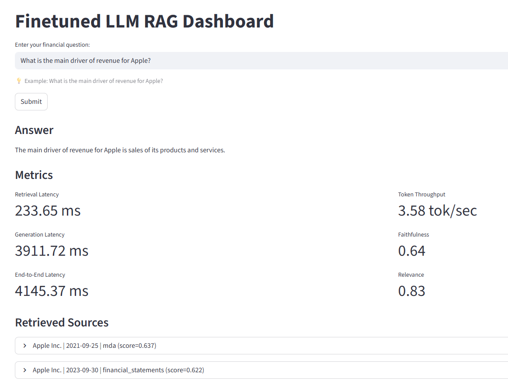

# Domain Adaptive Financial Q&A with Fine-tuned LLM + RAG

A portfolio project demonstrating an end-to-end pipeline for answering questions about public company financials using SEC 10-K filings, a QLoRA fine-tuned language model, and a retrieval-augmented generation (RAG) system — demonstration available via a Streamlit dashboard.

---

## What it does

Ask a natural language question like *"What were Apple's primary revenue drivers?"* and the system will:

1. Retrieve the most relevant excerpts from a FAISS vector store built on SEC 10-K filings
2. Pass those excerpts + the question to a fine-tuned LLM
3. Return a grounded answer with source citations and live quality metrics (faithfulness, relevance, latency, token throughput)

---

## Project structure

```
da-financial-qa/
├── app.py              # Streamlit dashboard (entry point)
│
├── fetch.py            # Download 10-K filings from SEC EDGAR
├── clean.py            # Parse HTML → clean text → JSONL chunks
├── finetune.py         # QLoRA fine-tuning with HuggingFace PEFT
├── rag.py              # Build FAISS index and retrieval pipeline
├── eval_compare.py     # Evaluate and compare model configurations
│
├── requirements.txt
└── README.md
```

---

## Quickstart

### Local setup

```bash
pip install -r requirements.txt

requirements.txt installs the CPU-compatible PyTorch build by default for maximum compatibility.

For GPU acceleration (recommended for fine-tuning and inference), install the CUDA-enabled PyTorch build for your system before installing requirements.

# Build the dataset (no GPU needed)
python fetch.py
python clean.py

# Fine-tune (needs GPU)
python finetune.py

# Build RAG index
python rag.py

# Evaluate configurations
python eval_compare.py

# Launch the Streamlit app
streamlit run app.py
```

### System Diagram

```text
User Query
    ↓
[Embedding Model - BGE-M3]
    ↓
[FAISS Vector Search]
    ↓
Retrieved Chunks ──────────────────┐
    ↓                              │
[Prompt Builder]                   │
    ↓                              │
[TinyLlama / Finetuned LLM]        │
    ↓                              │
Generated Answer                   │
    ↓                              ↓
[Evaluation Layer] ──── Faithfulness (ROUGE-L)
                   ──── Answer Relevance (cosine sim)
                   ──── Context Relevance (cosine sim)
    ↓
Streamlit Dashboard
```

## Download Required Artifacts

Large artifacts are hosted on Hugging Face Hub: https://huggingface.co/datasets/lcoon12/da-financial-qa

Command: git clone https://huggingface.co/datasets/lcoon12/da-financial-qa

- model/
- data/

After downloading, put them into the project root:

da-financial-qa/
├── models/
├── data/
---

## Pipeline details

### `fetch.py` — Data collection
Downloads up to 5 recent annual 10-K filings per company from SEC EDGAR for ~120 companies across technology, finance, healthcare, energy, consumer, industrials, communication, and real estate sectors. Raw HTML is cached under `data/raw/` and filing metadata is saved to `data/filings.json`.

### `clean.py` — Data cleaning & chunking
Processes each raw HTML filing through a multi-stage pipeline:
- Strips HTML markup and drops numerical-heavy tables
- Removes noise (separator lines, exhibit references, page numbers)
- Extracts named sections: Business, Risk Factors, MD&A, Market Risk, Financial Statements
- Splits filings into overlapping ~400-token chunks using section-aware and sentence-boundary-aware chunking to preserve semantic coherence and improve RAG retrieval quality.

Output is `data/chunks.jsonl` where each record contains the chunk text, an instruction-tuning `messages` field, and metadata (company, CIK, period, section).

### `finetune.py` — QLoRA fine-tuning
Fine-tunes `TinyLlama/TinyLlama-1.1B-Chat-v1.0` on the chunked data using QLoRA (4-bit NF4 quantization + LoRA adapters on attention matrices).

The LoRA adapter is saved to `models/lora-adapter/` and merged into the base model at `models/merged/`.

### `rag.py` — Vector index
Embeds all chunks with BAAI/bge-m3 and stores them in a FAISS IndexFlatIP. The index is saved to data/faiss.index and the chunk store to data/chunk_store.json.

The retrieval pipeline also implements lightweight metadata-aware retrieval:

- Detects company names mentioned in the query using normalized company matching
- Filters retrieved chunks to the detected company when possible
- Reduces cross-company retrieval errors common in financial RAG systems

This improves retrieval grounding for companies with overlapping terminology across SEC filings.

### `inference.py` — CLI inference
The `DAFinancialQAPipeline` class combines retrieval and generation. It retrieves the top-k chunks for a query, formats a prompt with numbered context excerpts, generates an answer, and returns source citations.

### `eval_compare.py` — Evaluation
Compares four configurations against a hand-crafted golden QA set (8 questions):

| Configuration | Description |
|---|---|
| Fine-tuned + RAG | Best expected configuration |
| Base + RAG | RAG benefit without fine-tuning |
| Fine-tuned, no RAG | Fine-tuning benefit without RAG |
| Base, no RAG | Baseline |

Metrics used:

| Metric | Description |
|---|---|
| Answer Similarity | Cosine similarity between generated and reference answer |
| Answer Relevance | Cosine similarity between question and generated answer |
| Faithfulness | ROUGE-L precision of answer against retrieved context |
| Context Relevance | Mean cosine similarity between question and retrieved chunks |

Full results are saved to `outputs/eval_results.json`.

---

## Streamlit dashboard (`app.py`)

The app exposes the full retrieval + generation pipeline through a browser UI. After submitting a question it displays:

- The generated answer
- Retrieved source excerpts (company, period, section, relevance score)
- Live metrics: retrieval latency, generation latency, end-to-end latency, token throughput, faithfulness, and answer relevance

Run with: `streamlit run app.py` 


---

## Key design decisions

**Why QLoRA?** Full fine-tuning a 7B model requires ~56GB GPU RAM. QLoRA quantizes the frozen base model to 4-bit and trains only small low-rank adapter matrices. Achieves competitive downstream performance with substantially lower GPU memory requirements.

**Why RAG on top of fine-tuning?** Fine-tuning teaches the model *how* to reason about financial language. RAG gives it *which* document to reason about. They address different problems and are complementary.

**Why sentence-boundary chunking?** Fixed-size token chunking cuts mid-sentence, losing context at boundaries. Sentence-aware chunking with overlap preserves context between chunks.

**Why metadata-aware retrieval?** Pure semantic retrieval can surface chunks from the wrong company. Metadata-aware retrieval detects company mentions in the user query and filters FAISS candidates by company metadata, reducing cross-company contamination in generated answers.